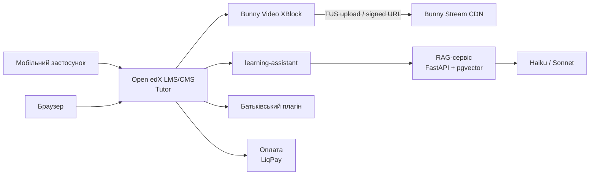
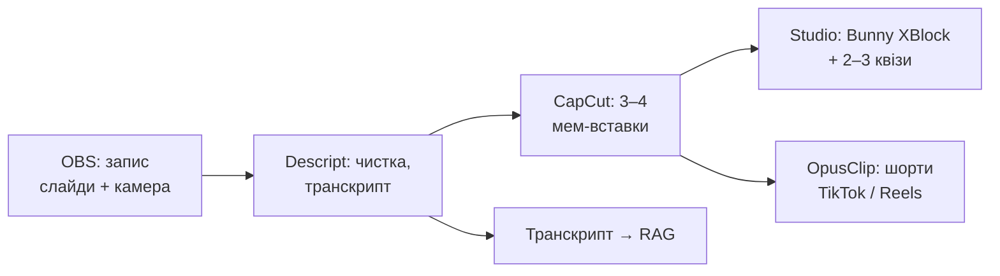

# PRD: Навчальна платформа на Open edX

2026-09-17

## Контекст і проблема

Будуємо платформу шкільних курсів на Open edX: короткі відеолекції з мемами, квізи, AI-репетитор по предмету, мобільний застосунок. Аудиторія — школярі та студенти: стартуємо з класу дитини, далі група, інші класи й студентські курси. За школярів платять батьки, студенти платять самі.

Проблема: наявні українські ресурси (Всеукраїнська школа онлайн, «На Урок») дають контент, але не утримують зумерів — довгі лекції без монтажу, немає інтерактиву у відео, немає репетитора, який відповідає в контексті уроку. Вчителі не мають простого способу монетизувати свої матеріали.

Чому Open edX, а не Moodle: нативний мобільний застосунок (Kotlin/Swift), Coursera-подібний UX, готова основа AI-асистента (learning-assistant / ai-aside), XBlocks на Python. Ціна цього вибору — важче розгортання (Tutor, 8 ГБ RAM) і відсутність батьківської ролі з коробки.

## Цілі та не-цілі

Ціль MVP: за 3 місяці один предмет для одного класу з 30 живими учнями, 5+ вчителями-авторами і першими платежами від батьків.

Цілі:

- Учень дивиться відеолекції по 5–10 хв, проходить квізи всередині відео, питає AI-репетитора в контексті уроку.
- Батько бачить прогрес дитини і платить підписку.
- Вчитель завантажує відео та квізи через Studio, не знаючи про Bunny/Vimeo, і отримує частку доходу.
- Мобільний застосунок у сторах під власним брендом.
- Логи питань до AI показують, які теми не зрозуміли — це вхід для нових роликів.

Не-цілі MVP:

- Live-уроки, вебінари, відеодзвінки.
- Власний відеопайплайн (транскодування, HLS) — це Bunny Stream.
- Повне покриття шкільної програми; MVP = один предмет.
- DRM enterprise-рівня; достатньо token-захисту посилань.
- Інтеграція з державними системами (АІКОМ, Мій клас).

## Користувачі

П'ять ролей; батько — окрема роль, якої в Open edX немає, і це кастомна розробка. Студент — стандартний користувач Open edX без батьківського контролю.

| Роль | Що робить | Що йому потрібно від платформи |
| --- | --- | --- |
| Школяр (12–17 років) | Дивиться лекції, проходить квізи, питає AI | Мобільний застосунок, короткі відео, без нудьги, миттєва відповідь на «я не зрозумів» |
| Студент (18+) | Те саме, але платить сам і обирає курси | Сертифікат за курс, глибший AI-репетитор, вебінтерфейс важливіший за застосунок |
| Батько | Платить, контролює школяра | Прогрес дитини, час у курсі, оцінки квізів, підписка в 2 кліки |
| Вчитель / викладач | Записує лекції, робить квізи | Завантаження відео в один крок, банк питань, звіт по групі, виплати |
| Адмін (ви) | Розгортає, модерує, налаштовує AI і виплати | Tutor, логи AI-діалогів, аналітика, Bunny dashboard |

## Функціональні вимоги

П'ять модулів; три з них (відео, AI, батьки) — власна розробка поверх Open edX, решта — конфігурація.

| Модуль | Вимога | Джерело | Пріоритет |
| --- | --- | --- | --- |
| Курси й квізи | Курс = юніти по 5–10 хв; квізи з автоперевіркою (multiple choice, numeric, drag-and-drop), банк питань, рандомізація | Open edX з коробки (Studio, problem XBlocks) | MVP |
| Відео | XBlock «Video»: TUS-завантаження з браузера в Bunny, плеєр з підписаним токеном, події перегляду в трекінг; альтернатива — вставити посилання YouTube або Vimeo, якщо відео вже там (без захисту токеном) | Власний XBlock (форк xblock-video) | MVP |
| Інтерактивне відео | Питання, яке зупиняє відео на таймкоді; без відповіді відео не йде далі | Розширення того ж XBlock | Етап 2 |
| AI-репетитор | Чат у контексті юніту; RAG по транскриптах і конспектах курсу; роутинг Haiku → Sonnet; правило «не розв'язуй домашку» | learning-assistant + власний RAG-бекенд | MVP (базовий), роутинг — етап 2 |
| Батьківський кабінет | Зв'язок акаунтів батько↔учень, прогрес, час у курсі, оцінки, email-звіт щотижня | Власний Django-плагін + API | MVP (мінімальний) |
| Оплата | Підписка на предмет; LiqPay/Monobank; доступ до курсу за фактом оплати | Django-плагін, enrollment API | MVP |
| Мобільний застосунок | Форк openedx-app-android/ios, брендування, публікація в сторах | Конфігурація + збірка | Етап 2 |
| Тема оформлення (темна) | НЕ пишемо свою: Tutor Indigo вже має перемикач світлої/темної теми, увімкнений за замовчуванням (`tutor plugins install indigo`, `tutor plugins enable indigo`, `tutor local do settheme indigo`). Брендинг — `tutor config save --set 'INDIGO_PRIMARY_COLOR="#..."'`; глибша кастомізація — форк і правки `_extras.scss` | Конфігурація (плагін) | MVP |
| Вхід через соцмережі | НЕ пишемо: в edx-platform це вбудований python-social-auth (Google, Facebook, Microsoft, Apple, LinkedIn, GitHub, Twitter + будь-який OAuth2/OIDC/SAML). Увімкнення маленьким yaml-плагіном (`FEATURES["ENABLE_THIRD_PARTY_AUTH"]`, `THIRD_PARTY_AUTH_BACKENDS`), провайдери заводяться в Django-адмінці (`/admin/third_party_auth/oauth2providerconfig/`, redirect виду `https://lms.домен/auth/complete/google-oauth2/`). Вмикаємо Google + Apple (Apple вимагає Sign in with Apple для iOS-застосунку, якщо є інший соцлогін), GitHub — бонусом; `ENABLE_REQUIRE_THIRD_PARTY_AUTH` НЕ вмикати, звичайна пошта лишається запасним входом | Конфігурація (плагін) | MVP |
| Українська локалізація | НЕ пишемо і плагін не потрібен: переклади вже в платформі (openedx-translations, тягнуться в образ через atlas pull), вмикається одним рядком `LANGUAGE_CODE: "uk"`. Зараз частково: ядро LMS українською, але нові рядки й окремі MFE місцями падають в англійську (community-переклад, ~75% серверних рядків); наші XBlock і так українською | Конфігурація | MVP |
| Повний український переклад | Дофарбувати community-переклад до 100%: доперекласти відсутні рядки ядра, MFE й власних XBlock через Transifex/openedx-translations (pull request туди ж — стане на користь усім), закрити fallback на англійську | Перекладацька робота + збірка | Етап 2 |
| Аналітика | Перегляди по юнітах, кидання відео, результати квізів, топ питань до AI | Tracking logs + Bunny analytics | Етап 2 |

## Технічна архітектура

Open edX через Tutor на одному VPS (8 ГБ RAM, 4 CPU, 50 ГБ), відео повністю поза сервером у Bunny Stream, AI — окремий сервіс з RAG.

Учень працює через застосунок або браузер; відео йде з Bunny напряму, минаючи сервер; AI-запити йдуть через learning-assistant у власний RAG-сервіс.

Компоненти:

- **Tutor** — стандартне розгортання, плагіни через tutor-contrib; XBlocks додаються в образ, цикл збірки 10–20 хв.
- **Bunny Video XBlock** — форк xblock-video (Raccoon Gang) з новим бекендом Bunny поряд із наявними YouTube і Vimeo: Studio-view з TUS-upload або полем для посилання, student-view з плеєром і токеном, події `play/pause/complete` в tracking.
- **AI** — openedx/learning-assistant + ai-aside як UI, бекенд свій: FastAPI, pgvector, ембеддинги транскриптів (з Descript), системний промпт репетитора, класифікатор ескалації. Prompt caching на конспекті.
- **Батьківський плагін** — Django app у edx-platform: модель `ParentLink`, сторінка прогресу через Grades API і completion, щотижневий email через Celery.
- **Оплата** — Django app: вебхук LiqPay → enrollment у курс, окремий course mode «paid».
- **Мобільний** — форк openedx-app-android / openedx-app-ios, OAuth-клієнти на сервері, mobile API увімкнено; Bunny плеєр працює у WebView.
- **Тема Indigo** — темна тема як Tutor-плагін, а не власна розробка: перемикач світла/темна з коробки, увімкнений за замовчуванням. Чесна оговорка: це плагін поверх платформи, а не системна можливість — окремі MFE (Authn, ORA, Studio) можуть підхоплювати її частково. Для студентського LMS достатньо; у Studio викладачі переживуть світлу.
- **Соцлогін** — нічого не пишемо: готові бекенди python-social-auth, заводяться yaml-плагіном і записами провайдерів у Django-адмінці; кнопки з'являються на сторінці логіну самі. Google є у всіх (шкільні акаунти), GitHub — не у всіх, тому база — Google + Apple.

Вартість інфраструктури на старті: VPS \~$40/міс, Bunny \~$5/міс, LLM $20–60/міс при 300 учнях, Apple Developer $99/рік, Google Play $25.

## Контент-пайплайн

Одна 10-хвилинна лекція коштує вчителю 1,5–2 години; монтаж і шорти може робити одна людина за всіх.

Транскрипт із Descript одночасно йде і в субтитри, і в базу знань AI-репетитора; шорти з мемами ведуть на повну лекцію.

Правила формату:

- Юніт 5–10 хв, не більше; перші 10 секунд — гачок.
- Кожні 2–3 хв — візуальна зміна (мем, схема, крупний план).
- Мем пояснює, а не прикрашає: серйозна тема + абсурдна аналогія.
- Квіз-питання наприкінці кожного юніту; з етапу 2 — усередині відео.
- Перші 5–10 курсів робимо самі, вчителів запрошуємо «поправити під себе».

## Монетизація і мотивація вчителів

Платить батько за підписку на предмет; вчитель-автор отримує 70 % з оплат за свій курс.

| Модель | Хто платить | Ціна | Етап |
| --- | --- | --- | --- |
| Підписка на предмет | Батько (школяр) / студент сам | 150–200 грн/міс школярам; 300–500 грн за курс студентам | MVP |
| Revenue share автору | Платформа → вчитель | 70/30 | MVP |
| Freemium | — | Теорія і базові квізи безкоштовно; AI-репетитор і розбір помилок платно | Етап 2 |
| Репетиторство через платформу | Батько → вчитель | Комісія 15 % | Етап 3 |
| Ліцензія для школи | Школа | За клас/рік | Етап 3 |

Що мотивує вчителя окрім грошей: автоперевірка квізів економить години, курс живе роками, публічна сторінка автора з учнями й відгуками, технічну частину (монтаж, оцифровка тестів) бере платформа.

Чого не робимо: не платимо фіксовано за курс наперед, не вимагаємо ексклюзиву на контент, не запускаємо безкоштовну платформу «для всіх» без плану виплат.

## Ризики та пом'якшення

Найбільший ризик не технічний: вчителі не завантажать контент, а зумери не додивляться лекції.

| Ризик | Ймовірність | Пом'якшення |
| --- | --- | --- |
| Вчителі не приходять | Висока | Перші 5 вчителів особисто, 70/30, платформа робить монтаж і оцифровку за них |
| Учні кидають відео на 2-й хвилині | Висока | Ліміт 10 хв на юніт, метрика «додивились до кінця» з першого тижня, шорти як тестер тем |
| AI розв'язує домашку за учня | Середня | Окремий перевіряльник відповіді, логування, роутинг на Sonnet для математики |
| Open edX виявиться заважким для одного розробника | Середня | Tutor без кастомізації ядра; все своє — окремі плагіни й сервіси; запасний план — Moodle з тими ж Bunny і RAG |
| Витік відео (скрін, перезалив) | Середня | Token auth + domain lock у Bunny; DRM не робимо, приймаємо ризик |
| Публікація в App Store затягується | Середня | MVP у браузері; застосунок — етап 2 |
| Конкуренція з безкоштовними ресурсами | Середня | Не «ще одна платформа», а конкретна ніша: один предмет, один клас, мемний формат, репетитор |

## Roadmap

MVP за 12 тижнів у браузері з одним предметом; мобільний застосунок і роутинг AI — після перших платежів.

| Етап | Тижні | Що готово |
| --- | --- | --- |
| 0. Інфраструктура | 1–2 | Tutor на VPS, Bunny акаунт, домен, 1 тестовий курс; тема Indigo + соцлогін Google/Apple |
| 1. Відео | 3–4 | Bunny Video XBlock: upload зі Studio, плеєр з токеном, події перегляду |
| 2. Контент | 3–8 | 10 юнітів одного предмета за пайплайном OBS → Descript → CapCut; квізи; транскрипти |
| 3. AI-репетитор | 5–8 | learning-assistant + RAG на Haiku, промпт репетитора, логи |
| 4. Батьки й оплата | 7–10 | ParentLink, сторінка прогресу, LiqPay → enrollment |
| 5. Запуск | 11–12 | Клас дитини + друзі, 5 вчителів, перші шорти в TikTok |
| Етап 2 | 13–20 | Мобільний застосунок у сторах, інтерактивні квізи у відео, роутинг Haiku → Sonnet, аналітика, повний український переклад |
| Етап 3 | 21+ | Другий предмет, репетиторство, заявка в USF / Освіторію з живими метриками |

## Метрики успіху

Через 3 місяці після запуску: 30 активних учнів, 5 вчителів-авторів, 10 платних підписок.

| Метрика | Ціль через 3 міс | Як вимірюємо |
| --- | --- | --- |
| Активні учні (тиждень) | 30 | Tracking logs, ≥1 юніт/тиждень |
| Додивились юніт до кінця | ≥ 60 % | Події `complete` Bunny XBlock |
| Квізи пройдено з 1-ї спроби | ≥ 50 % | Problem events |
| Вчителі-автори з ≥1 курсом | 5 | Studio |
| Платні підписки | 10 | LiqPay |
| Батьки, що зайшли в кабінет за місяць | ≥ 50 % платних | Парент-плагін |
| Запитів до AI на учня на тиждень | 5+ | Логи RAG-сервісу |
| Ескалацій AI на учня на місяць | < 20 % | Логи роутингу (етап 2) |
| Витрати на LLM на учня | < $0.20/міс | Рахунок API |

## Відкриті питання

- [ ] Який предмет і клас для MVP — той, що вчить дитина зараз, чи той, де легше знайти вчителів?
- [ ] Хто робить монтаж лекцій: вчитель сам, ви, чи найнятий монтажер на відсоток?
- [ ] Юридична форма для прийому оплат і виплат вчителям з урахуванням служби — ФОП на партнера, ТОВ, ГО?
- [ ] Чи потрібен український LLM-провайдер / локальна модель через персональні дані дітей?
- [ ] Чи достатньо email-звіту батькам у MVP, чи потрібна повна сторінка прогресу з першого дня?
- [ ] Vimeo без коду на старті замість Bunny XBlock, щоб зекономити 2 тижні розробки?
