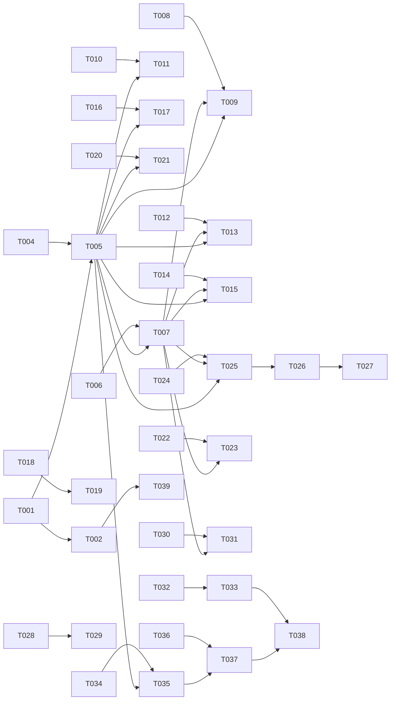

# Tasks: Відео в курсах — завантаження, плеєр, події перегляду (001-bunny-video)

**Input**: [spec.md](./spec.md), [plan.md](./plan.md), [data-model.md](./data-model.md), [contracts/](./contracts/), [research.md](./research.md), [quickstart.md](./quickstart.md)
**Призначення**: фаза /speckit-tasks. Декомпозиція на 39 задач.

## Правила виконання (спадкові для всіх задач)

- TDD (конституція II): тест перший, червоний з очікуваної причини, потім код, потім зелений. Одна задача — один прохід субагента.
- Тести не ходять у мережу: Bunny — тільки записані фікстури `video_xblock/tests/fixtures/bunny/` (research R12: статуси 0–6 через фікстури).
- Константи, що впливають на результат, — тільки `video_xblock/bunny_config.yaml` (T-005), до всіх споживачів. Секрети — тільки Django settings (T-003).
- Кожен файл коду несе `impl: FR-001-NN` у шапці, кожен тест — `verifies: FR-001-NN`. Фікстури, що містять FR-ID як дані, — рядок `trace: ignore-file`.
- Задачі з міткою `critical:` виконує implementer-senior одразу.
- spec.md і plan.md під час імплементації не редагувати; задача нездійсненна як специфікована → BLOCKED із поясненням.

---

## Phase 1: Setup

- [x] T-001 [FR-001-01] Завендорити форк `raccoongang/xblock-video` (master) у `video_xblock/` зі збереженням `video_xblock/LICENSE` (GPL-3.0, research R13), без змін коду; переконатися, що пакет імпортується (`python3 -c "import video_xblock"`).
- [x] T-002 [FR-001-01] Запустити наявний тестовий набір форка (pytest у `video_xblock/tests/`) і переконатися, що базовий рівень зелений — це база для червоних тестів наступних фаз.
  примітка: вирівняно 2 апстрім-дефекти @9a6f808 (код↔тест) без зміни коду форка
- [x] T-003 [FR-001-07] Створити каркас `tutor-plugin/plugin.yml` і `tutor-plugin/patches/`: XBlock у вимоги образу edx-platform, CSP LMS `frame-src https://player.mediadelivery.net`, `Referrer-Policy` для iframe, секрети `BUNNY_STREAM_LIBRARY_ID` / `BUNNY_STREAM_API_KEY` / `BUNNY_STREAM_TOKEN_KEY` через tutor secrets (quickstart S0, plan Constraints).

## Phase 2: Foundational

- [x] T-004 [FR-001-02, FR-001-04, FR-001-09, FR-001-14] Напиши тест `video_xblock/tests/unit/test_bunny_config.py` (`verifies: FR-001-02, FR-001-04, FR-001-09, FR-001-14`): завантажувач конфігурації з жорсткою валідацією схеми й меж за contracts/bunny-config-contract.md §3 (0 < completion_threshold ≤ 1; token_ttl_seconds > 0; max_upload_bytes > 0; allowed_extensions непорожній; URL — https; fail-fast на битий YAML/типи), запусти, переконайся, що червоний з очікуваної причини (модуль/файл відсутній).
- [x] T-005 [FR-001-02, FR-001-04, FR-001-09, FR-001-14] Створи `video_xblock/bunny_config.yaml` (канонічний `version: 1.0.0` з changelog за контрактом) і завантажувач `video_xblock/bunny_config.py` (завантаження один раз на старті XBlock, fail-fast); у шапці YAML рядок `# impl: FR-001-02, FR-001-04, FR-001-09, FR-001-14`, у .py — `impl: ...`; тест T-004 зелений. Задача йде ДО всіх споживачів констант (принцип III).
- [x] T-006 [FR-001-05, FR-001-09] Напиши записані фікстури у `video_xblock/tests/fixtures/bunny/` (create video 200/401; video_info зі статусами 0–6 і `length`; 404; delete 200/404; embed 403 — R12; у фікстурах рядок `trace: ignore-file`) і тест `video_xblock/tests/unit/test_bunny_api_client.py` (`verifies: FR-001-05, FR-001-09`): методи `BunnyApiClient` — create_video, get_video_info (мапування статусів 0–6 → стани XBlock), delete_video (ідемпотентний 404), signed_embed_url (формула R6: sha256_hex(token_key + videoId + expires)); без мережі, тільки фікстури; запусти, переконайся, що червоний з очікуваної причини (клас відсутній).
- [x] T-007 [FR-001-05, FR-001-09] critical: Створи `video_xblock/backends/bunny.py` — клас `BunnyApiClient(BaseApiClient)`: create_video, get_video_info, delete_video, sign_upload, signed_embed_url за contracts/bunny-api.md §1–5 (базові URL з YAML, секрети з Django settings, помилки API → зрозумілі повідомлення); шапка `impl: FR-001-05, FR-001-09`; тест T-006 зелений. critical: помилка у формулі підпису/спливу тихо відкриває або закриває доступ до відео (FR-001-09).

## Phase 3: User Story 1 (P1) — вчитель завантажує відео в один крок

- [x] T-008 [FR-001-02] Напиши тест `video_xblock/tests/unit/test_create_upload.py` (`verifies: FR-001-02`): валідація входу `create_upload` — розширення ∈ allowed_extensions (mp4/mov/webm), MIME починається з `video/`, непідтримуваний файл → 400 зі зрозумілим повідомленням ДО виклику Bunny (фікстура create video не викликається); запусти, переконайся, що червоний з очікуваної причини (хендлер відсутній).
- [x] T-009 [FR-001-02] Створи хендлер `create_upload` у `video_xblock/backends/bunny.py` (`BunnyPlayer`, `@XBlock.json_handler`): перевірки формату з YAML, створення відео через `BunnyApiClient`, запис метаданих (bunny_video_id, bunny_library_id, bunny_status=UPLOADING, bunny_title, source_type, token_protected, config_version), відповідь за contracts/xblock-interface.md §2.1; маркер `impl: FR-001-02`; тест T-008 зелений.
- [x] T-010 [FR-001-04] Напиши тест `video_xblock/tests/unit/test_upload_limits.py` (`verifies: FR-001-04`): file_size > max_upload_bytes → 400 з поясненням ліміту ДО будь-якого виклику Bunny (фікстура не викликається); розмір ≤ ліміту → успіх і фікстура create video викликана; запусти, переконайся, що червоний з очікуваної причини (перевірка відсутня).
- [x] T-011 [FR-001-04] Додай серверну перевірку розміру в `create_upload` у `video_xblock/backends/bunny.py` (повторна валідація проти `max_upload_bytes` з YAML — захист від підробки клієнта, research R4); маркер `impl: FR-001-04`; тест T-010 зелений.
- [x] T-012 [FR-001-03, FR-001-09] Напиши тест `video_xblock/tests/unit/test_upload_credentials.py` (`verifies: FR-001-03, FR-001-09`): хендлер `upload_credentials` перепідписує ТОЙ САМИЙ GUID (фікстура create video не викликається, sign_upload викликана) і повертає свіжий `{authorization_signature, authorization_expire}` за contracts/xblock-interface.md §2.2; запусти, переконайся, що червоний з очікуваної причини (хендлер відсутній).
- [x] T-013 [FR-001-03, FR-001-09] critical: Створи хендлер `upload_credentials` у `video_xblock/backends/bunny.py` (re-sign того самого video_id, формула TUS-підпису R6, `upload_auth_ttl_seconds` з YAML); маркер `impl: FR-001-03, FR-001-09`; тест T-012 зелений. critical: неправильний підпис/сплив → resume мовчки ламається, FR-001-03 (продовження з місця обриву) не виконується.
- [x] T-014 [FR-001-05] Напиши тест `video_xblock/tests/unit/test_video_info.py` (`verifies: FR-001-05`): хендлер `video_info` проти фікстур статусів 0–6 (R12): 0/1 → UPLOADING, 2/3 → PROCESSING, 4 → READY з bunny_length_seconds, 5/6 → ERROR; length > max_duration_seconds → ERROR + DELETE (фікстура delete); метадані блоку оновлюються; запусти, переконайся, що червоний з очікуваної причини (хендлер відсутній).
- [x] T-015 [FR-001-05] critical: Створи хендлер `video_info` у `video_xblock/backends/bunny.py` (полінг-проксі GET за contracts/bunny-api.md §3, мапування статусів, ліміт тривалості з видаленням відео — R4); маркер `impl: FR-001-05`; тест T-014 зелений. critical: тиха помилка мапування статусу/тривалості лишає блок у невірному стані — вчитель публікує неготове відео (FR-001-05).
- [x] T-016 [FR-001-01] Напиши тест `video_xblock/tests/unit/test_bunny_studio_view.py` (`verifies: FR-001-01`): рендер студіо-вкладки `video_xblock/templates/bunny_studio_tab.html` — стан EMPTY: кнопка «Завантажити» без полів ручного ID; стан READY: тривалість видима; контекст містить bunny_config (max_upload_bytes, allowed_extensions); запусти, переконайся, що червоний з очікуваної причини (шаблон відсутній).
- [x] T-017 [FR-001-01] Створи `video_xblock/templates/bunny_studio_tab.html` і студіо-контекст у `video_xblock/backends/bunny.py`: стани EMPTY/UPLOADING/PROCESSING/READY/ERROR за data-model.md §1, кнопки «Завантажити»/«Вставити посилання», тривалість у READY, значення `bunny` додано у вибір `player_name`; маркер `impl: FR-001-01`; тест T-016 зелений.
- [x] T-018 [FR-001-02, FR-001-03, FR-001-04] Напиши jest-тест `video_xblock/tests/js/bunny_upload.test.js` і мінімальний jest-харнес (`package.json`, `jest.config.js` у `video_xblock/tests/js/`): чиста функція пре-валідації (розширення/розмір до запиту), збірка TUS-опцій з даних create_upload (headers AuthorizationSignature/AuthorizationExpire/LibraryId/VideoId, metadata filetype+title), resume-шлях через мок tus-js-client (без мережі), 404 на resume → новий create_upload; запусти, переконайся, що червоний з очікуваної причини (модуль відсутній).
- [x] T-019 [FR-001-02, FR-001-03, FR-001-04] Створи `video_xblock/static/js/studio/bunny_upload.js` (tus-js-client: пресет-дані з create_upload, resume через localStorage/findPreviousUploads, прогрес-бар, обробка помилок TUS, 404 → create_upload наново); маркер `impl:` у шапці JS (коментар); тест T-018 зелений.
- [ ] T-020 [FR-001-06] Напиши тест `video_xblock/tests/unit/test_bunny_metadata.py` (`verifies: FR-001-06`): `metadata_fields()` повертає точно список з data-model.md §1; експорт OLX блоку з READY-відео не містить секретів (API key, token key) і підписаного URL плеєра (інваріанти data-model); запусти, переконайся, що червоний з очікуваної причини (метод відсутній).
- [ ] T-021 [FR-001-06] Створи `metadata_fields()` та інваріанти у `video_xblock/backends/bunny.py` (`BunnyPlayer`): без секретів, без збереженого підписаного URL — відео живе тільки в Bunny, на сервері лише метадані (FR-001-06); маркер `impl: FR-001-06`; тест T-020 зелений.
- [ ] T-022 [FR-001-16] Напиши тест `video_xblock/tests/unit/test_delete_video.py` (`verifies: FR-001-16`): хендлер `delete_video` викликає DELETE (фікстура 200), очищає метадані, стан EMPTY; повторний DELETE на неіснуюче (фікстура 404) — успіх (ідемпотентно); replace: create_upload поверх READY → старий GUID видалено; запусти, переконайся, що червоний з очікуваної причини (хендлер відсутній).
- [ ] T-023 [FR-001-16] Створи хендлер `delete_video` і replace-шлях у `create_upload` у `video_xblock/backends/bunny.py` (старий video_id → DELETE перед новим; події перегляду інших юнітів не чіпаються — вони адресують свій usage_key, data-model §1); маркер `impl: FR-001-16`; тест T-022 зелений.

## Phase 4: User Story 2 (P1) — учень дивиться відео; посилання не перевикористовується

- [ ] T-024 [FR-001-09, FR-001-14] Напиши тест `video_xblock/tests/unit/test_student_view.py` (`verifies: FR-001-09, FR-001-14`): `player_data_setup` — контекст містить signed_embed_url (token/expires за формулою R6, expires = now + token_ttl_seconds з YAML), completion_threshold з YAML передається в JS-контекст, config_version; URL не зберігається в метаданих і міняється між рендерами (cache-buster, bunny-api §5); запусти, переконайся, що червоний з очікуваної причини (метод відсутній).
- [ ] T-025 [FR-001-09] critical: Реалізуй `player_data_setup`/підпис embed-URL у `video_xblock/backends/bunny.py`: свіжий підписаний URL на кожен рендер студентського в'ю (token = sha256_hex(token_key + videoId + expires), TTL з YAML), token_protected=true; маркер `impl: FR-001-09`; тест T-024 зелений. critical: сплив токена/підпис — помилка тихо дає або забирає доступ (FR-001-09, SC-003).
- [ ] T-026 [FR-001-07] Напиши тест рендера студентського в'ю у `video_xblock/tests/unit/test_student_view.py` (продовження, `verifies: FR-001-07`): `video_xblock/templates/bunny_student_view.html` — iframe `https://player.mediadelivery.net/embed/{libraryId}/{videoId}?token&expires`, `referrerpolicy="strict-origin-when-cross-origin"`, підключені `video_xblock/static/js/lib/playerjs.min.js` і `video_xblock/static/js/student/bunny_player.js`, без переходу на сторонні сайти; запусти, переконайся, що червоний з очікуваної причини (шаблон відсутній).
- [ ] T-027 [FR-001-07] Створи `video_xblock/templates/bunny_student_view.html` і `get_player_html` у `video_xblock/backends/bunny.py`; завендорити `video_xblock/static/js/lib/playerjs.min.js` (player.js, MIT, зі збереженням ліцензії, research R5); маркер `impl: FR-001-07`; тест T-026 зелений.
- [ ] T-028 [FR-001-08] Напиши тест `video_xblock/tests/unit/test_access_guards.py` (`verifies: FR-001-08`): студійні хендлери (create_upload, upload_credentials, video_info, delete_video) недоступні в LMS-контексті; save_event недоступний у Studio; студентський рендер для незарахованого учня не видає підписаного URL (заглушка платформенної авторизації); запусти, переконайся, що червоний з очікуваної причини (гварди відсутні).
- [ ] T-029 [FR-001-08] Додай гварди у `video_xblock/backends/bunny.py` (перевірка контексту Studio/LMS і авторизації за contracts/bunny-api.md §7); маркер `impl: FR-001-08`; тест T-028 зелений.
- [ ] T-030 [FR-001-10] Напиши тест `video_xblock/tests/unit/test_unavailable.py` (`verifies: FR-001-10`): bunny_status=ERROR або 404 у Bunny (фікстура) → студентське в'ю рендерить зрозуміле «Відео недоступне», не порожній плеєр; подія перегляду при помилці не емітується (tracking-events §3); запусти, переконайся, що червоний з очікуваної причини (обробка відсутня).
- [ ] T-031 [FR-001-10] Реалізуй стан недоступності у `video_xblock/backends/bunny.py` і `video_xblock/templates/bunny_student_view.html` (повідомлення замість iframe; 403/404 embed → UI-fallback); маркер `impl: FR-001-10`; тест T-030 зелений.

## Phase 5: User Story 3 (P2) — події перегляду дають метрику «додивились до кінця»

- [ ] T-032 [FR-001-14] Напиши jest-тест `video_xblock/tests/js/bunny_player.test.js`: чиста функція `shouldFireComplete(current, duration, threshold)` — 0.97 → true, 0.40 → false, перемотка на 0.99 без накопичення → false, межа 0.95; дедуплікація complete на сесію, replay після ended — нова сесія (два complete, US3.4); запусти, переконайся, що червоний з очікуваної причини (модуль відсутній).
- [ ] T-033 [FR-001-14] critical: Створи `video_xblock/static/js/student/bunny_player.js`: міст player.js (ready/play/pause/timeupdate/ended/error → save_event), `shouldFireComplete` з completion_threshold з контексту YAML, сесійний прапорець complete, replay = нова сесія, повідомлення про помилку відтворення; тест T-032 зелений. critical: поріг 95 % і зарахування повного перегляду — помилка тихо спотворює метрику «додивились до кінця» (FR-001-14).
- [ ] T-034 [FR-001-12, FR-001-13, FR-001-15] Напиши тест `video_xblock/tests/unit/test_save_event.py` (`verifies: FR-001-12, FR-001-13, FR-001-15`): хендлер `save_event` валідує event_type ∈ {play, pause, complete} і числа, для Bunny ігнорує клієнтський duration (бере з метаданих), публікує через мокований runtime.publish події `xblock-video.player.play|pause|complete` з payload за contracts/tracking-events.md §2 (user_id, course_id, unit_usage_key, video_ref, config_version); фікстури повного (0.97) і неповного (0.40) перегляду; запусти, переконайся, що червоний з очікуваної причини (хендлер відсутній).
- [ ] T-035 [FR-001-12, FR-001-13, FR-001-15] critical: Створи хендлер `save_event` у `video_xblock/backends/bunny.py`: сервер підставляє user_id/course_id/unit_usage_key/video_ref/config_version (не довіряє клієнту), публікує через runtime.publish — первинний запис метрики (конституція V); маркер `impl: FR-001-12, FR-001-13, FR-001-15`; тест T-034 зелений. critical: прив'язка подій до учня — помилка тихо спотворює метрику «додивились до кінця» (FR-001-13).

## Phase 6: User Story 4 (P3) — вчитель вставляє готове посилання YouTube/Vimeo

- [ ] T-036 [FR-001-11] Напиши тест `video_xblock/tests/unit/test_youtube_vimeo.py` (`verifies: FR-001-11`): вставка посилання YouTube/Vimeo (наявний потік форка) — студентське в'ю рендериться без token-параметрів; save_event формує video_ref.source_type ∈ {youtube, vimeo} для зовнішніх джерел (R7); недоступне посилання → повідомлення про недоступність; запусти, переконайся, що червоний з очікуваної причини (формування video_ref відсутнє).
- [ ] T-037 [FR-001-11] Додай формування `video_ref` для youtube/vimeo у `video_xblock/backends/bunny.py` (save_event) і переконайся, що наявні бекенди форка не зламано; маркер `impl: FR-001-11`; тест T-036 зелений.

## Phase 7: Polish

- [ ] T-038 [FR-001-01] Прогнати весь набір: pytest `video_xblock/tests/unit/` + jest `video_xblock/tests/js/` + `python3 scripts/trace.py --check` — усе зелене; згенерувати `docs/traceability.md` (`python3 scripts/trace.py`).
- [ ] T-039 [FR-001-11] Регресія: наявний сьют форка (YouTube/Vimeo/інші бекенди) зелений; пройти quickstart.md S1–S15 як чек-лист ручної перевірки (не автоматизується — живі сервіси; S13 — конституційний гейт, рішення людини).

---

## Граф залежностей



Текстом (критичні ребра):

```
Setup:            T-001 → T-002; T-003 (незалежний, потребує лише plan.md)
Foundational:     T-004 → T-005 (YAML — ДО всіх споживачів констант)
                  T-006 → T-007 (клієнт; залежить від T-001 і T-005)
US1:              T-008 → T-009; T-010 → T-011; T-012 → T-013; T-014 → T-015
                  T-016 → T-017; T-018 → T-019; T-020 → T-021; T-022 → T-023
                  усі код-задачі US1 — після T-005 і T-007
US2:              T-024 → T-025; T-026 → T-027 (після T-025); T-028 → T-029;
                  T-030 → T-031 (після T-007); усі — після T-005
US3:              T-032 → T-033; T-034 → T-035 (після T-005 і T-021)
US4:              T-036 → T-037 (після T-035 — потрібен save_event)
Polish:           T-038, T-039 — в самому кінці, після всіх код-задач
```

Правило «тест → червоний → код → зелений» діє всередині кожної пари; тестова задача йде одразу перед своєю код-задачею. Кожна код-задача перевіряється рівно одним тестом (своєю тестовою задачею).

## Приклади паралельності

Субагенти-імплементери змінюють файли послідовно, але граф показує, де можна паралелити на рівні планування/гілок (не всередині однієї фічі-гілки):

1. Після T-007 незалежні «червоні» гілки US1: T-008, T-010, T-012, T-014, T-016, T-020, T-022 — різні тестові файли, без спільного стану.
2. US2 (T-024..T-031) паралельна зі Studio-хвостом US1 (T-014..T-023): спільні залежності — лише T-005 і T-007.
3. Jest-задачі (T-018/T-019, T-032/T-033) — окремий раннер і каталог `video_xblock/tests/js/`, паралельні з будь-якими pytest-задачами.
4. US4 (T-036/T-037) — після T-035, паралельна з Polish T-039 (регресія форка).

## Стратегія MVP (US1 + US2)

MVP = Setup + Foundational + US1 + US2 (T-001..T-031). US3/US4 — P2/P3, не блокують випуск. Критерій готовності MVP: `python3 scripts/trace.py --check` зелений, pytest + jest зелені, ручні сценарії quickstart S1–S8, S13 (гейт захисту відео — рішення людини), S14. Якщо задача MVP нездійсненна як специфікована — `BLOCKED` із поясненням, spec.md не правиться.

## MVP scope

Фази першого випуску (P1) та їхні задачі:

- **Setup**: T-001, T-002, T-003
- **Foundational**: T-004, T-005, T-006, T-007
- **US1** (завантаження вчителем): T-008..T-023
- **US2** (перегляд учнем + захист): T-024..T-031

Разом — 31 задача (T-001..T-031). Поза MVP: US3 (T-032..T-035), US4 (T-036, T-037), Polish (T-038, T-039).
escalated: T-008 implementer->implementer-senior, reason=спроба 1: 5 тестів зелені до коду (локальні helpers); спроба 2: таймаут без змін
