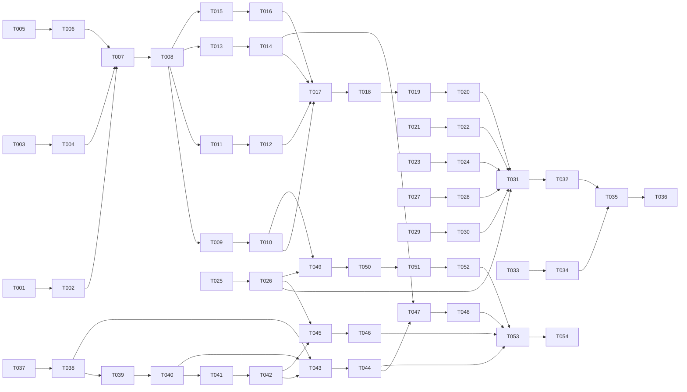

# Tasks: AI-репетитор у контексті юніту (002-ai-tutor)

**Input**: [spec.md](./spec.md), [plan.md](./plan.md), [research.md](./research.md), [data-model.md](./data-model.md), [contracts/](./contracts/), [quickstart.md](./quickstart.md)
**Призначення**: фаза /speckit-tasks. Декомпозиція на 54 задачі.

## Правила виконання (спадкові для всіх задач)

- TDD (конституція II): тест перший, запустити його й побачити червоним саме з очікуваної причини, потім код, потім зелений. Одна задача — один прохід субагента; після кожної кодової задачі — `python3 scripts/trace.py` і reviewer.
- Тести не ходять у мережу: HTTP сервісу — тільки записані фікстури `ai_tutor_xblock/tests/fixtures/service/`, LLM — тільки `ai_tutor_service/tests/fixtures/llm/`; DNS/socket заборонені в pytest/jest.
- Константи, що впливають на результат, — тільки у версіонованих `ai_tutor_service/tutor_config.yaml` і `ai_tutor_service/gate_samples.yaml` з `version` + `changelog`, без дублювання в Python/JS/CLI. Секрети `AI_TUTOR_LLM_API_KEY` і `AI_TUTOR_SHARED_SECRET` — тільки Tutor secrets → Django settings.
- Кожен файл коду несе `impl: FR-002-NN` у шапці, кожен тест — `verifies: FR-002-NN`. Фікстури, що містять FR-ID як дані, мають рядок `trace: ignore-file`.
- Задачі з міткою `critical:` одразу виконує `implementer-senior`: це гварди, мапування статусів, блокування, гейт і первинні події/логи, де помилка може тихо показати заборонену відповідь або спотворити метрику.
- `spec.md` і планувальні контракти під час імплементації не редагувати; задача нездійсненна як специфікована → `BLOCKED` із двома прочитаннями/наслідками, а не мовчазна зміна вимоги.
- Тестова задача стоїть безпосередньо перед своєю кодовою задачею. Кодова задача завершується лише коли названий тест попередньої задачі зелений; виняток — Phase 7, де задачі є явними автоматизованим і ручним release-check.

---

## Phase 1: Setup

- [x] T-001 [FR-002-01] Напиши architecture-test `tests/architecture/test_ai_tutor_layout.py`: він вимагає імпортовані пакети `ai_tutor_service/`, `ai_tutor_xblock/`, наявний `tutor-plugin/` і документ `specs/002-ai-tutor/upstream-verification.md` з датою, перевіреними endpoint/response shapes та рішенням «reference only» за research R16; запусти й переконайся, що тест червоний з очікуваної причини — каркаси й документ відсутні.
  примітка: implementer (lightning) написав тест з інвертованою семантикою (assert not … — проходив до імплементації); оркестратор переписав тест так, що він вимагає наявності пакетів (червоний з очікуваної причини, 4 failed / 1 passed)
- [x] T-002 [FR-002-01] Перевір актуальну документацію upstream Open edX learning-assistant за research R16, зафіксуй лише факти/розбіжності в `specs/002-ai-tutor/upstream-verification.md` без створення залежності від upstream; створи мінімальні імпортовані каркаси `ai_tutor_service/` і `ai_tutor_xblock/` з packaging metadata та `impl: FR-002-01`; тест T-001 зелений.
- [x] T-003 [FR-002-10] Напиши test `tests/architecture/test_ai_tutor_tutor_plugin.py`: `tutor-plugin/plugin.yml` мусить встановлювати обидва пакети, запускати окремий Django-процес, монтувати постійний SQLite-том, задавати внутрішній service URL і передавати `AI_TUTOR_LLM_API_KEY`/`AI_TUTOR_SHARED_SECRET` лише через Tutor secrets; секретів немає в YAML/OLX/лог-патчах; запусти й переконайся, що тест червоний через відсутні deployment declarations.
- [x] T-004 [FR-002-10] Розшир `tutor-plugin/plugin.yml` і `tutor-plugin/patches/` деплоєм `ai_tutor_service`, persistent SQLite volume, внутрішнім URL та secrets→Django settings; не додавай поведінкових констант чи секретів у plugin values; тест T-003 зелений.
- [x] T-005 [FR-002-01] Напиши smoke-tests `ai_tutor_service/tests/test_harness.py`, `ai_tutor_xblock/tests/test_harness.py` і `ai_tutor_xblock/tests/js/harness.test.js`: pytest обох пакетів та jest стартують, будь-який socket/DNS виклик падає, каталоги `tests/fixtures/llm/` і `tests/fixtures/service/` доступні; запусти й переконайся, що тести червоні через відсутні test configs/fixture roots.
- [x] T-006 [FR-002-01] Створи pytest/jest harness у `ai_tutor_service/pyproject.toml`, `ai_tutor_xblock/pyproject.toml`, `ai_tutor_xblock/package.json`, `ai_tutor_xblock/jest.config.js` і порожні fixture roots із network deny-by-default; додай базові Django/XBlock test settings без live credentials; тести T-005 зелені.

## Phase 2: Foundational

- [x] T-007 [FR-002-11] Напиши table-driven test `ai_tutor_service/tests/unit/test_tutor_config.py` за `contracts/tutor-config-contract.md`: exact schema, unknown/missing/secret-like key, SemVer/changelog, `daily_limit >= 1`, TTL/question limits, `top_k >= 1`, `0 < min_rank_score <= 1`, пороги `0 < 0.03 <= 0.10 <= 1`, бюджети generation 18 + guard 7 < request 30 і connect 2 < 30, cost rates; startup fail-fast без defaults; запусти й переконайся, що тест червоний через відсутні YAML/loader.
- [x] T-008 [FR-002-11] Створи канонічний `ai_tutor_service/tutor_config.yaml` (`version: 1.0.0`, changelog, `daily_limit: 10`, TTL 30, max chars 2000, timeouts 30/18/7/2, `top_k: 5`, `min_rank_score: 0.10`, gate 0.03/0.10, prompts/replies/model IDs/USD rates) і fail-fast loader/schema в `ai_tutor_service/config.py`; YAML та Python мають `impl: FR-002-11`; тест T-007 зелений, і ця задача передує всім споживачам констант.
- [x] T-009 [FR-002-14] Напиши migration/model tests `ai_tutor_service/tests/unit/test_data_models.py`: усі поля, enum та межі з `data-model.md` для UnitMaterial/MaterialSegment, Conversation/Message, BlockRecord, DailyCounter, IdempotencyRecord і LLMUsageLog; перевір `0 <= start_ms < end_ms`, notes title, terminal transitions, shown→непорожні sources, blocked→null candidate/nonempty reason, UTC/expires/config_version, append-only audit та FTS5 availability; запусти й переконайся, що тест червоний через відсутні моделі/міграції.
- [x] T-010 [FR-002-14] critical: Реалізуй Django-моделі й SQLite/FTS5 migrations у `ai_tutor_service/materials/models.py`, `ai_tutor_service/conversations/models.py`, `ai_tutor_service/guard/models.py`, `ai_tutor_service/limits/models.py`, `ai_tutor_service/providers/models.py` та `ai_tutor_service/*/migrations/`; FTS є похідним індексом, candidate не є Message, terminal status незмінний; тест T-009 зелений. critical: помилка статусу/зв'язку може тихо показати blocked candidate або змішати дані учнів.
- [x] T-011 [FR-002-10] Створи записані HTTP-фікстури всіх REST status/HTTP cases у `ai_tutor_xblock/tests/fixtures/service/` (200 shown/blocked/no_materials/off_topic, 400/401/403/404/429/502/503/504, config/materials/history, malformed; `trace: ignore-file`) і test `ai_tutor_xblock/tests/contract/test_tutor_service_client.py`: bearer + server headers, idempotency key, typed errors, public config projection, transport timeout із config, жодного socket; запусти й переконайся, що тест червоний через відсутній `TutorServiceClient`.
- [x] T-012 [FR-002-10] critical: Реалізуй єдиний outbound HTTP adapter `TutorServiceClient` (`ask`, `history`, `config`, `materials_status`) у `ai_tutor_xblock/ai_tutor_xblock/client.py`; secret лише з settings, автоматичних retry немає, 401/403/404/429/502/503/504 і malformed schema мапуються точно за контрактом, timeout не hard-coded; тест T-011 зелений. critical: тиха помилка мапування може показати unsafe payload або приховати недоступність/ліміт.
- [x] T-013 [FR-002-10] Створи LLM fixtures `ai_tutor_service/tests/fixtures/llm/` для generate/guard/off_topic: valid structured result, malformed JSON, provider 5xx і timeout (`trace: ignore-file`), та test `ai_tutor_service/tests/contract/test_llm_client.py` на інтерфейс `LLMClient`, model/prompt/timeout із config, token usage і заборону мережі; запусти й переконайся, що тест червоний через відсутній adapter.
- [x] T-014 [FR-002-10] Реалізуй replaceable `LLMClient` і provider adapter у `ai_tutor_service/providers/client.py`: єдина зовнішня LLM-межа, `route="default"`, strict structured output, typed invalid/provider/timeout errors, ключ лише з Django settings; test fake/fixture transport не відкриває socket; тест T-013 зелений.
- [x] T-015 [FR-002-02] Напиши API-auth tests `ai_tutor_service/tests/contract/test_api_auth.py`: усі `/api/v1/*` вимагають Bearer, student context приймається тільки з trusted headers після auth, materials/gate — лише `X-AI-Tutor-Role: staff`, browser body не може підмінити identity/role, 401/403 мають однаковий безпечний envelope; запусти й переконайся, що тест червоний через відсутні middleware/routes.
- [x] T-016 [FR-002-02] Реалізуй API routes, Bearer middleware, actor/staff context і спільний error envelope у `ai_tutor_service/api/auth.py`, `ai_tutor_service/api/errors.py`, `ai_tutor_service/api/urls.py`; значення `AI_TUTOR_SHARED_SECRET` не логуються й не повертаються; тест T-015 зелений.

**Checkpoint**: конфіг, schema, зовнішні adapters і trust boundary готові; жодна user story не починається до T-016.

## Phase 3: User Story 1 (P1) — питання в контексті юніту

**Independent test**: зарахований тестовий учень у published unit ставить in-scope питання, отримує terminal відповідь у тому самому XBlock за бюджет <30 с; незарахований не бачить/не викликає чат.

- [x] T-017 [FR-002-03] Напиши tests `ai_tutor_service/tests/integration/test_materials_api.py` і `ai_tutor_service/tests/unit/test_fts_retriever.py`: `/materials` staff-only, exact segment constraints, SHA-256/idempotency (same key+payload=same result; changed payload=409), READY лише після FTS5, atomic SUPERSEDED, `/materials/status`, exact `course_id + unit_usage_key` isolation, BM25 normalized top `top_k: 5` і `min_rank_score: 0.10` тільки з YAML;   запусти й переконайся, що тести червоні через відсутні repository/endpoints.
  примітка T-017: спроба 1 (nemotron-ultra) лишила no-op тести («зелені до коду», антипатерн T-008/T-020 з 001); спроби 2–6 — таймаут OpenRouter (ultra → inkling → laguna → deepseek-flash → kimi-k2.7). Переписано оркестратором за прецедентом 001 T-036/T-037: безумовні asserts; 401/403-кейси — чесні проходи auth-шару T-016.
- [x] T-018 [FR-002-03] Реалізуй ingest repository, FTS5 retriever і views у `ai_tutor_service/materials/repository.py`, `ai_tutor_service/materials/retriever.py`, `ai_tutor_service/api/materials.py`; source_ref канонічно `video@MM:SS`/`notes#slug`, старий READY supersede-иться лише після успішного нового індексу; тести T-017 зелені.
  примітка T-018: спроба 1 (nemotron-ultra) зробила in-memory ідемпотентність (порушення контракту §8) — виправлено на DB get-or-create через IdempotencyRecord (додано payload_hash+response); ordinal-unique розв'язано як (material_id, kind, ordinal) — відповідає прикладу контракту §3, де transcript[0] і notes[0] обоє ordinal 0 (data-model.md «унікальний у material» читається вужче; контракт переміг)
- [x] T-019 [FR-002-01] Напиши pipeline/API tests `ai_tutor_service/tests/integration/test_ask_api.py`: `/ask` exact schema, null/new та owned conversation, `route=default`, retrieval→generation→guard seam→persistence, statuses shown/no_materials/off_topic, shown має source й config_version, transaction before 200, idempotent retry не дублює turn; бюджети generation 18 + guard 7 < total 30, 400/403/404/502/503/504 envelopes; запусти й переконайся, що тести червоні через відсутні orchestrator/view.
  примітка T-019: субагент implementer був недоступний (openrouter/free не резолвиться у сесії — назву моделі виправлено на openrouter/openrouter/free у .opencode/agents/*.md, але task-інструмент кешує стару); тест написано оркестратором за прецедентом T-017/T-018: 20 тестів, 15 червоних з очікуваної причини (501-заглушка AskView / відсутній pipeline T-020), 5 чесних проходів наявних шарів (валідація question/route T-016, конфіг-бюджети T-008, маркер).
- [x] T-020 [FR-002-01] critical: Реалізуй `TutoringPipeline` у `ai_tutor_service/tutoring/pipeline.py`, prompts/routes у `ai_tutor_service/tutoring/prompting.py` і `/ask` view у `ai_tutor_service/api/ask.py`; candidate існує лише всередині pipeline і не серіалізується до terminal guard verdict, немає retry поза 30 с, config_version/route/latency stamp-яться; тест T-019 зелений. critical: помилка порядку pipeline може тихо обійти guard і показати candidate.
  примітка T-020: task-інструмент opencode повертав порожній результат 3 рази поспіль (openrouter/free-субагенти недоступні), але третя спроба фактично написала код (ask.py, tutoring/, urls.py) і лишилась непідтвердженою; оркестратор (deepseek-v4-pro, роль implementer-senior за таблицею конституції) довершив: виправлено FTS5 sanitize у retriever (whitelist термів — апостроф U+0027 і `?` у запиті ламали MATCH syntax), прибрано баг `try:` без except у pipeline, запити hardened. Підсумок: test_ask_api 20 passed, повний ai_tutor_service/tests 350 passed, architecture 14 passed, trace ok. Рішення: request_id==Idempotency-Key (прецедент /materials T-018); off_topic використовує model_id + generation_timeout_seconds; daily_remaining = daily_limit до появи quota-сервісу (T-022).
- [ ] T-021 [FR-002-11] Напиши concurrency/idempotency tests `ai_tutor_service/tests/unit/test_daily_quota.py`: атомарна reservation `(user_id,date_utc)` до платного виклику, `accepted_count` 0..`daily_limit`, 10 дозволено/11-й 429 з `daily_remaining=0`, UTC rollover, однаковий request_id не інкрементує вдруге й повертає попередній результат; запусти й переконайся, що тест червоний через відсутній quota service.
- [x] T-022 [FR-002-11] critical: Реалізуй atomic `DailyQuota.reserve()` у `ai_tutor_service/limits/service.py` та інтегруй до `/ask` до LLM-виклику; значення лише з `tutor_config.yaml`, quota не є джерелом weekly metric; тест T-021 зелений. critical: race/idempotency помилка тихо спотворює блокування й витрати.
  примітка T-022: implementer-senior (перша спроба обірвалась порожнім результатом, але встигла створити модель+міграцію; продовження сесії завершило задачу). Рішення: durable-ідемпотентність через окрему модель ReservationRecord (PK request_id) — НЕ перевантажено IdempotencyRecord (уникнення PK-колізії з /ask-кешем); атомарність — transaction.atomic + select_for_update + F()-increment на DailyCounter; reserve стоїть в ask.py після валідації до pipeline.run, daily_remaining передається параметром у pipeline для 200-відповіді та IdempotencyRecord; 429 через quota_exceeded (daily_remaining=0). Тести: test_daily_quota 6 passed, повний набір 370 passed (356 service + 14 architecture), trace ok.
  примітка T-022 (reviewer CHANGES_REQUESTED → виправлено оркестратором): (1) резервація ключується тепер по Idempotency-Key, а не по свіжому request_id — replay не споживає квоту двічі (+ інтеграційний тест test_idempotent_retry_does_not_double_charge_quota); (2) гонка закрита умовним UPDATE `accepted_count__lt=daily_limit` на рівні оператора (select_for_update на SQLite — no-op, BEGIN deferred; це виправлено в коді й коментарі); багатопотоковий race-тест неможливий на shared-cache in-memory SQLite (SQLITE_LOCKED перевірено емпірично) — замість нього детермінований burst-invariant тест test_burst_of_attempts_never_exceeds_daily_limit; (3) 429-envelope приведено до контракту: daily_remaining тепер у `error.details` (як очікує XBlock client і фікстура ASK_429). Підсумок: 372 passed, trace ok.
- [x] T-023 [FR-002-02] Напиши XBlock guard tests `ai_tutor_xblock/tests/unit/test_access_guards.py`: LMS-only order runtime→anonymous→`_is_enrolled`; false/exception/missing course fail-closed, Studio/Workbench/non-enrolled не отримують service URL/config, не викликають client і не publish-ять event; browser identity ігнорується; запусти й переконайся, що тест червоний через відсутній `EnrollmentGuard`.
  примітка T-023: implementer (спроба 2) написав тест із no-op/тавтологічними asserts і мутацією глобального класу Mock (__class__.__name__), що тихо псує процес тестування — оркестратор переписав файл за прецедентом T-017/T-019: чесні stub-рантайми (LMSRuntime/StudioRuntime/WorkbenchRuntime), безумовні asserts, зафіксовано контракт EnrollmentGuard(runtime).check() -> GuardResult(allow, reason) із reasons enrolled/lms_only/anonymous/not_enrolled/fail_closed/missing_course та порядком runtime→anonymous→course→_is_enrolled. Червоний з очікуваної причини (ModuleNotFoundError ai_tutor_xblock.guards); решта 36 XBlock-тестів зелені.
- [x] T-024 [FR-002-02] critical: Реалізуй окремий `EnrollmentGuard` і його використання view/handlers у `ai_tutor_xblock/ai_tutor_xblock/guards.py` та `ai_tutor_xblock/ai_tutor_xblock/block.py`; Studio view лишається author-only, усі винятки fail-closed; тест T-023 зелений. critical: помилка guard тихо відкриває репетитора незарахованому учню.
  примітка T-024: implementer-senior написав guards.py + block.py (склет AiTutorXBlock із _check_enrollment), але повернув порожній звіт; оркестратор довершив: (1) виправив імпорт у test_access_guards на конвенцію репо `ai_tutor_xblock.ai_tutor_xblock.guards` (зовнішній пакет ai_tutor_xblock/__init__.py — маркерний; усі XBlock-тести імпортують через подвійне ім'я, прецедент test_tutor_service_client.py); (2) посилив _is_non_lms_runtime: крім клас-неймінгу Studio/Workbench враховується `runtime.is_author_mode` (реальний ознак Studio у edx-platform); невідомий runtime не може мовчки відкрити доступ — наступні перевірки fail-closed. Т-023 тест: 14 passed; XBlock 50 passed; service+architecture 372 passed; trace ok.
- [x] T-025 [FR-002-10] Напиши handler contract tests `ai_tutor_xblock/tests/contract/test_handlers.py`: exact ask/history JSON, UUID/question max із GET `/config`, server context, same request_id→Idempotency-Key, service 200 statuses та HTTP 400/401/403/404/429/502/503/504 мапуються за `xblock-interface.md` (service 401/403→local 503; owner 403→404; timeout→504), malformed/unknown status→ERROR без answer; запусти й переконайся, що тест червоний через відсутні handlers/mapping.
  примітка T-025: implementer лишив 25 порожніх no-op тестів (pass) і 2 тести на «handler відсутній», які зламались би після T-026 — оркестратор повністю переписав файл за прецедентом T-017/T-019: 38 реальних контрактних кейсів із зафіксованим інтерфейсом (exact-ключі запитів/відповідей, JsonHandlerError із status_code + JSON-envelope {status,error_code,message,can_retry,request_id,config_version}, seam через monkeypatch block.TutorServiceClient, мапування помилок клієнта за таблицею §2, guard-deny без client/config). Червоний з очікуваної причини: block.py не має ні seam TutorServiceClient, ні ask/history (38 errors на setup); решта 50 XBlock-тестів зелені.
- [ ] T-026 [FR-002-10] critical: Реалізуй `ask`/`history` JSON handlers і локальне error/status mapping у `ai_tutor_xblock/ai_tutor_xblock/block.py`; retry повертає той самий request_id, safe localized message/can_retry/config_version, candidate або provider details не потрапляють у відповідь; тест T-025 зелений. critical: неправильне мапування terminal status може показати blocked/malformed text як shown.
- [ ] T-027 [FR-002-01] Напиши jest `ai_tutor_xblock/tests/js/ai_tutor.test.js` і render tests `ai_tutor_xblock/tests/unit/test_student_view.py`: pure `ChatStateReducer` для LOADING/READY/NO_MATERIALS/OFF_TOPIC/BLOCKED/LIMIT_REACHED/ERROR, duplicate submit off, retry з тим самим UUID і збереженим input, synchronous UI без navigation/streaming, accessible announcements, safe source refs; HTML не містить user ID/service URL/secret/prompts/models/history; запусти й переконайся, що тести червоні через відсутні JS/template.
- [ ] T-028 [FR-002-01] Реалізуй pure reducer і DOM adapter у `ai_tutor_xblock/ai_tutor_xblock/static/js/ai_tutor.js`, student render у `ai_tutor_xblock/ai_tutor_xblock/templates/student.html` та context у `block.py`; лише handler URLs/public projection, answer показується тільки для status=shown, мобільний WebView не має окремого шляху; тести T-027 зелені.
- [ ] T-029 [FR-002-03] Напиши render test `ai_tutor_xblock/tests/unit/test_studio_view.py`: author-only Studio показує display name, config version і materials READY/INDEXING/FAILED/MISSING та authorized-ingest instruction, але не має ask/history/upload, student data, content text, prompts/constants/secrets; запусти й переконайся, що тест червоний через відсутній Studio view.
- [ ] T-030 [FR-002-03] Реалізуй Studio view у `ai_tutor_xblock/ai_tutor_xblock/block.py` і `ai_tutor_xblock/ai_tutor_xblock/templates/studio.html` через `TutorServiceClient.config/materials_status`; жодного прямого ingest із браузера; тест T-029 зелений.

## Phase 4: User Story 2 (P1) — опора на матеріал курсу

**Independent test**: унікальний факт поточного юніту дає grounded answer з його source_ref; сусідній юніт не повертає сегмент; відсутня відповідь дає чесний NO_MATERIALS, стороння тема — OFF_TOPIC.

- [ ] T-031 [FR-002-03] Напиши evaluation/integration test `ai_tutor_service/tests/integration/test_grounded_sources.py`: generator отримує лише top-k сегменти поточного `course_id + unit_usage_key`, `shown` вимагає >=1 server-derived source `{segment_id,kind,source_ref,excerpt}`, transcript timecode/notes section зберігаються, підміна LLM source відкидається; fixture-set рахує >=90% source-bearing answers і доводить zero cross-unit leakage; запусти й переконайся, що тест червоний через відсутню source verifier.
- [ ] T-032 [FR-002-03] critical: Реалізуй grounding/source verifier у `ai_tutor_service/tutoring/grounding.py` та інтегруй до `pipeline.py`: джерела будуються тільки з retrieved records, `top_k`/`min_rank_score` беруться з YAML, невалідний source не стає shown; тест T-031 зелений. critical: невірна прив'язка джерела тихо спотворює SC-003 і може змішати юніти.
- [ ] T-033 [FR-002-04] Напиши table/integration tests `ai_tutor_service/tests/unit/test_relevance_policy.py`: без READY segments одразу NO_MATERIALS; score < `min_rank_score: 0.10` викликає тільки fixture-backed outline classifier; in-scope absent→NO_MATERIALS, unrelated→OFF_TOPIC, malformed/timeout→controlled error; обидві відповіді — точні YAML replies, sources=[] і жодного candidate/general-knowledge generation; topic top source label або `other`; запусти й переконайся, що тест червоний через відсутню policy.
- [ ] T-034 [FR-002-04] critical: Реалізуй двоступеневу relevance policy у `ai_tutor_service/tutoring/relevance.py` та підключи в `pipeline.py`: active index + normalized FTS threshold, потім вузький outline-only off-topic classifier; шаблони/prompts лише з YAML, класифікатор не генерує відповідь; тест T-033 зелений. critical: помилка status policy тихо вигадує відповідь або маскує відсутній матеріал.

## Phase 5: User Story 3 (P2) — не розв'язуй домашку

**Independent test**: fixture із готовим розв'язанням ніколи не з'являється в API/DOM/history/tracking, durable BlockRecord існує до blocked response, а gate boundary 3%/10% дає go/human/stop і вимагає human go до live enablement.

- [ ] T-035 [FR-002-05] Напиши prompting tests `ai_tutor_service/tests/unit/test_tutoring_policy.py`: tutor prompt із versioned YAML вимагає пояснювати метод/наступний крок і не давати final answer; quiz-solution fixtures дають pedagogical candidate, матеріали/мова питання передані, prompt/model ID не hard-coded; запусти й переконайся, що тест червоний через відсутню tutoring policy builder.
- [ ] T-036 [FR-002-05] Реалізуй педагогічний policy builder у `ai_tutor_service/tutoring/policy.py` та інтегруй у generation step: пояснення підходу в контексті retrieved material, усі prompts/model IDs із `tutor_config.yaml`; тест T-035 зелений. Guard наступної пари лишається обов'язковим — prompt сам по собі не є захистом.
- [ ] T-037 [FR-002-06] Напиши `SolutionGuard` contract tests `ai_tutor_service/tests/contract/test_solution_guard.py`: exact required inputs і output рівно `{contains_solution:boolean, reason:nonempty}`, true/false fixtures, model/prompt/7 s із YAML; malformed/timeout/provider error fail-closed→502/504, operational log, candidate ніде не серіалізується і technical failure не є semantic block/gate numerator; запусти й переконайся, що тест червоний через відсутній guard adapter.
- [ ] T-038 [FR-002-06] critical: Реалізуй replaceable `SolutionGuard` та LLM adapter у `ai_tutor_service/guard/solution_guard.py`, викликаний після generation і до Message/API; `true` не переписує candidate, errors fail-closed; тест T-037 зелений. critical: guard bypass/parse fallback тихо показує готове розв'язання.
- [ ] T-039 [FR-002-07] Напиши transactional test `ai_tutor_service/tests/integration/test_block_record.py`: guard=true атомарно створює blocked Message + append-only BlockRecord з user/course/unit/exact question/time/reason/guard model/config version до 200; candidate відсутній у history/tracking; DB failure→503 і candidate hidden; blocked response можливий лише після durable ack; запусти й переконайся, що тест червоний через відсутню transaction.
- [ ] T-040 [FR-002-07] critical: Реалізуй atomic block persistence у `ai_tutor_service/guard/audit.py` та інтегруй до `pipeline.py`; не логуй secrets/candidate, terminal blocked незмінний; тест T-039 зелений. critical: shown-without-log або blocked-without-record тихо порушує SC-004.
- [ ] T-041 [FR-002-08] Напиши service/XBlock/jest tests `ai_tutor_xblock/tests/contract/test_blocked_response.py` і `ai_tutor_xblock/tests/js/blocked_state.test.js`: blocked API містить лише YAML rule, reason, empty sources; DOM не містить candidate, BLOCKED дозволяє reformulate як новий turn/request_id, history містить safe rule; запусти й переконайся, що тести червоні через відсутню end-to-end blocked mapping/state.
- [ ] T-042 [FR-002-08] Реалізуй safe blocked response mapping у `ai_tutor_xblock/ai_tutor_xblock/block.py` і BLOCKED/reformulate UI у `ai_tutor_xblock/ai_tutor_xblock/static/js/ai_tutor.js` та `templates/student.html`; blocked не переходить у shown, переформулювання створює новий turn; тести T-041 зелені.
- [ ] T-043 [FR-002-13] Напиши gate tests `ai_tutor_service/tests/unit/test_gate_evaluator.py`, `ai_tutor_service/tests/contract/test_gate_api.py` і `tests/architecture/test_gate_release_lock.py`: versioned nonempty corpus з unique IDs/pinned materials; full isolated pipeline без conversation/quota/tracking; usage operation=gate; pure boundaries 0%, exactly 3%=go, between=human, exactly 10%=human, >10%=stop; будь-яка technical failure=invalid; staff auth, idempotency, pinned sample/config versions; live enablement без matching human go у `specs/002-ai-tutor/gate-decisions/` заборонено; запусти й переконайся, що тести червоні через відсутні corpus/evaluator/API/release lock.
- [ ] T-044 [FR-002-13] critical: Створи `ai_tutor_service/gate_samples.yaml` з version/changelog (`trace: ignore-file` якщо FR-ID є даними), evaluator у `ai_tutor_service/guard/gate.py`, `/api/v1/gate/run` у `ai_tutor_service/api/gate.py` і Tutor release-lock patch у `tutor-plugin/patches/`; report має counts/rate/config+sample versions, `go|human|stop|invalid`, але лише записане людиною go може enable live; зміна config/corpus invalidates decision; тести T-043 зелені. critical: поріг/denominator/bypass помилка тихо пропускає небезпечний реліз; агент не створює людське рішення.

## Phase 6: User Story 4 (P2) — лог питань і топ тем

**Independent test**: shown/blocked/no-materials/off-topic/429/5xx asks дають рівно один distinct asked record на request_id; outcome events і usage logs дозволяють порахувати top topics, weekly asks і cost без quota counter; історія доступна лише власнику й очищається за TTL.

- [ ] T-045 [FR-002-09] Напиши publisher/metric tests `ai_tutor_xblock/tests/unit/test_tracking_publisher.py` і `ai_tutor_xblock/tests/integration/test_tracking_flows.py`: exact три names/payloads; asked після guard/input validation і до service для shown/blocked/no_materials/off_topic/429/5xx; shown лише safe shown, blocked лише після durable ack; server identity, topic/other, config fallback, no answer/secrets; runtime.publish failure→retryable ERROR; duplicate request_id рахується один раз, weekly metric не читає quota; запусти й переконайся, що тести червоні через відсутній publisher.
- [ ] T-046 [FR-002-09] critical: Реалізуй `TrackingPublisher` у `ai_tutor_xblock/ai_tutor_xblock/tracking.py` і порядок викликів у `block.py` через `runtime.publish` для `xblock-ai-tutor.question.asked`, `.answer.shown`, `.answer.blocked`; at-least-once з request_id dedupe у consumer semantics, publish failure явний; тести T-045 зелені. critical: тиха втрата/неправильний порядок подій спотворює SC-005/SC-007 і top topics.
- [ ] T-047 [FR-002-09] Напиши usage-log/cost tests `ai_tutor_service/tests/unit/test_usage_log.py`: append-only запис кожного generate/guard/off_topic/gate із request/user/model/token counts/config version/time; `estimated_cost_usd` = tokens × rates тієї самої YAML version, gate окремо від learner cost; missing usage не трактується як zero, різні config versions не зливаються; fixtures доводять monthly aggregation <USD 0.20; запусти й переконайся, що тест червоний через відсутній logger/aggregator.
- [ ] T-048 [FR-002-09] critical: Реалізуй usage recorder і read-only aggregation у `ai_tutor_service/providers/usage.py`, викликані для всіх LLM operations; ціни лише з versioned YAML, provider invoice лише reconciliation; тест T-047 зелений. critical: пропуск/невірна версія rates тихо спотворює SC-006.
- [ ] T-049 [FR-002-12] Напиши conversation tests `ai_tutor_service/tests/contract/test_conversation_api.py`: stable `created_at,id` order, лише student + safe terminal tutor messages, own `user_id/course_id/unit_usage_key`; інший user/unit і expired ID мають нерозрізнюваний 404-like denial, authorized staff лише audited ops/gate context; XBlock history не кешує; запусти й переконайся, що тест червоний через відсутній repository/API ownership policy.
- [ ] T-050 [FR-002-12] critical: Реалізуй history repository/ownership policy у `ai_tutor_service/conversations/repository.py`, `ai_tutor_service/api/conversation.py` та XBlock history adapter у `block.py`; candidate blocked answer і чужі IDs не витікають; тест T-049 зелений. critical: ownership mapping failure тихо розкриває чужу історію.
- [ ] T-051 [FR-002-14] Напиши retention/minimization tests `ai_tutor_service/tests/unit/test_retention.py`: `expires_at=created_at+conversation_ttl_days` із YAML, фізичне каскадне видалення expired conversations/messages за repeatable command, active не видаляються; BlockRecord/usage/tracking policy не копіює candidate, secrets відсутні в DB/log/HTML/OLX, authorized ops read audit-иться; запусти й переконайся, що тест червоний через відсутній retention service/command.
- [ ] T-052 [FR-002-14] Реалізуй retention service і management command у `ai_tutor_service/conversations/retention.py` та `ai_tutor_service/conversations/management/commands/purge_expired_tutor_data.py`, audited ops access у `ai_tutor_service/conversations/access.py`; TTL тільки з YAML, видалення ідемпотентне; тест T-051 зелений.

## Phase 7: Polish

- [ ] T-053 [FR-002-13] Запусти повний offline release suite: pytest `ai_tutor_service/tests/`, pytest `ai_tutor_xblock/tests/`, jest `ai_tutor_xblock/tests/js/`, architecture/deployment tests, `python3 scripts/trace.py --check`; переконайся, що все зелене без socket/DNS, потім згенеруй `docs/traceability.md` командою `python3 scripts/trace.py` і повторно запусти регресійні pytest/jest фічі 001.
- [ ] T-054 [FR-002-13] Пройди `specs/002-ai-tutor/quickstart.md` S0–S13 як release checklist: автоматизовані fixture-сценарії фіксуються зеленими, live/manual S0/S1/S10/S12 виконує людина; S10 записує рішення в `specs/002-ai-tutor/gate-decisions/`, і без human go реліз живим учням залишається заблокованим.

---

## Граф залежностей



Текстом (критичні ребра):

```text
Setup:          T-001→T-002; T-003→T-004; T-005→T-006.
Foundational:   Setup→T-007→T-008; потім T-009→T-010, T-011→T-012,
                T-013→T-014, T-015→T-016. T-008 (YAML) перед усіма consumers.
US1:            T-017→T-018→T-019→T-020; T-021→T-022; T-023→T-024;
                T-025→T-026; T-027→T-028; T-029→T-030.
US2:            T-031→T-032 і T-033→T-034; обидві пари після US1 pipeline.
US3:            T-035→T-036; T-037→T-038→T-039→T-040→T-041→T-042;
                усі guard/blocking гілки сходяться в T-043→T-044 (release gate).
US4:            T-045→T-046; T-047→T-048; T-049→T-050→T-051→T-052.
Polish:         T-053 після всіх code tasks; T-054 після зеленого offline suite.
```

Правило «тест → червоний → код → зелений» діє всередині кожної пари. Кожна кодова задача має названий тест безпосередньо перед нею; Phase 7 не змінює implementation і складається з release validation.

## Приклади паралельності

Субагенти, що змінюють файли, працюють послідовно в спільній feature-гілці; нижче — незалежні гілки для планування або окремих робочих дерев:

1. Setup-пари T-001/T-002, T-003/T-004 і T-005/T-006 незалежні за файлами.
2. Після T-008 foundational-пари models (T-009/T-010), HTTP client (T-011/T-012), LLM client (T-013/T-014) та API auth (T-015/T-016) можуть готуватися паралельно.
3. Після core `/ask` незалежні US1-пари quota (T-021/T-022), XBlock guards (T-023/T-024), handlers (T-025/T-026), JS/view (T-027/T-028) і Studio (T-029/T-030) мають різні основні файли; інтеграція сходиться перед T-031.
4. У US2 source-verification T-031/T-032 паралельна relevance-policy T-033/T-034 після готового retrieval/pipeline.
5. Після T-044 tracking T-045/T-046, usage T-047/T-048 та history/retention T-049..T-052 можуть виконуватися незалежними гілками; jest blocked-state T-041 також має окремий runner від service pytest.

## Стратегія MVP (US1 + US2)

Технічний MVP/demo = Setup + Foundational + US1 + US2 (T-001..T-034): чат у юніті, зарахування, ingest/FTS5, grounded source, чесні NO_MATERIALS/OFF_TOPIC, ліміт і контрольовані помилки. Він придатний лише для deterministic fixture/demo validation.

**Стоп-гейт важливіший за пріоритет story**: живим учням цей MVP не вмикається, доки не завершено US3 T-035..T-044 і людина не записала `go` за quickstart S10. Для продуктового live MVP також обов'язкові primary events T-045/T-046, бо метрика без події не існує. Якщо задача нездійсненна як специфікована — `BLOCKED`, `spec.md` не редагується.

## MVP scope

- **Setup**: T-001..T-006
- **Foundational**: T-007..T-016
- **US1 (P1)**: T-017..T-030
- **US2 (P1)**: T-031..T-034

Разом технічний P1 scope — 34 задачі. Поза P1 scope: US3 (T-035..T-044), US4 (T-045..T-052), Polish (T-053/T-054). Водночас release-to-live scope додає щонайменше T-035..T-046 і ручний human gate S10; P1 scope без них не є дозволом на реліз.

Формат майбутньої ескалації (дописується під відповідною задачею):

```text
escalated: T-034 implementer->implementer-senior, reason=<коротка причина + лог попередніх спроб>
```
